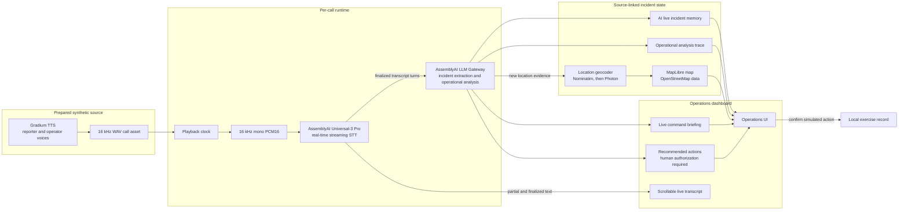
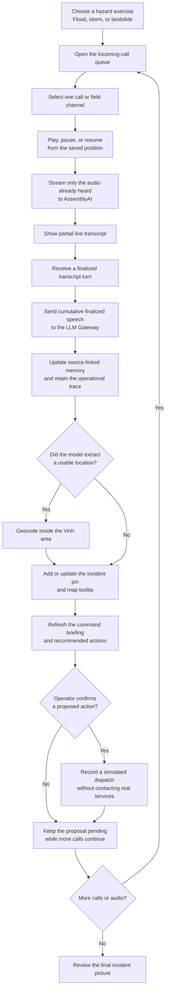

# CrisisSignal

CrisisSignal is a multi-hazard voice-to-command demonstration localized to Vinh City, Vietnam. It combines live AssemblyAI transcription, structured incident extraction, a shared map, source-linked briefings, and human-authorized response actions.

All incidents, measurements, casualties, timestamps, and responses in the scripted scenarios are fictional. Real Vinh landmarks are used only to make the hackathon demonstration understandable. The app never contacts or dispatches a real emergency service.

## Demonstration flow

Choose **Flood**, **Storm**, or **Landslide**, then play any call in the incoming-call queue. Each exercise presents multiple reporter, operator, and field conversations. Every call has independent playback position, live transcript state, source-linked incident memory, operational analysis, map evidence, command briefing, and guarded dispatch proposals.

- **Flood:** 35 cm of moving water at Ben Thuy Bridge 1; route closure, disaster-command notification, canoe standby, and public warning.
- **Tropical storm:** damaged roofing and an electrical hazard at Vinh Market; utility isolation, controlled evacuation, and technical assessment.
- **Landslide:** a 60 m unstable slide on the Nui Quyet access road; route closure, technical assessment, and targeted evacuation.

The complete conversations are pre-generated with Gradium as 16 kHz WAV assets. Generation permits no more than two active Gradium sessions, writes one file per call, and can be rerun safely because existing assets are reused. Normal playback never calls Gradium; it loads the prepared WAV and streams only the audio up to the player’s current position through AssemblyAI Universal-3 Pro. A sequential, retrying Gradium route remains as a missing-asset fallback.

The call-processing path is:

1. A prepared Gradium conversation plays from the selected call’s saved position.
2. Playback-clocked audio becomes 16 kHz mono PCM16.
3. AssemblyAI Universal-3 Pro Streaming returns partial and finalized transcript turns.
4. Each cumulative finalized transcript is sent server-side to AssemblyAI LLM Gateway.
5. The analyzer returns a constrained incident record and evidence-linked operational events.
6. A server-side geocoder resolves newly extracted location names inside the Vinh area.
7. The dashboard updates that call’s memory card, map, analysis log, briefing, and guarded action queue.

The LLM Gateway route serializes analysis across calls and retries transient rate-limit or server failures with backoff. Successful operational events are retained for the life of the exercise, newest first, with the finalized transcript-turn number and timestamp that produced each event. A later analysis failure never erases the last valid incident memory.

The analyzer supports flood, tropical storm, landslide, earthquake, wildfire, building collapse, other hazards, and unknown reports. Missing evidence stays **Unknown**. A malformed or incomplete analyzer response is rejected before it can update the interface.

The sidebar contains two focused views backed by the same exercise state:

- **Operations:** the complete command dashboard, including the incident map, independent call playback, live AssemblyAI transcripts, incident memory, operational analysis, briefings, and human-reviewed response proposals.
- **Architecture:** a visual trace of the Gradium audio, AssemblyAI transcription, LLM Gateway analysis, geocoding, memory, mapping, briefing, and authorization pipeline.

### Architecture



The browser receives short-lived AssemblyAI streaming tokens. Permanent AssemblyAI and Gradium keys stay server-side, while finalized transcript turns provide the evidence used to update memory, map state, briefings, and action proposals.

### App flow



Multiple calls share the same dashboard but retain independent playback, transcript, memory, map evidence, and analysis history. The LLM analysis queue is serialized so one call cannot overwrite another call’s incident state.

## Response authorization

AI recommendations are proposals only. Every simulated call or dispatch requires a separate operator confirmation dialog. Confirming an action records **Simulated dispatch sent** in local interface state; it does not call a phone number, send a message, or contact an agency.

The action catalog includes:

- Call disaster prevention command
- Dispatch rescue canoes
- Dispatch a medical team
- Close an affected access route
- Begin targeted evacuation
- Dispatch technical assessment
- Request utility isolation
- Issue a public safety alert

## Vinh City map

The app does not preload incident pins or assume where a call will originate. Once finalized speech gives the analyzer enough evidence to name a location, a server route searches OpenStreetMap data within a Vinh bounding box. The resulting coordinates belong to that call’s incident memory, and its pin appears dynamically. Operational qualifiers such as “northern approach” remain in memory even when the geocoder resolves the underlying landmark.

The route uses Nominatim first and Photon as a bounded fallback. It caches results, serializes external lookups, applies restrained English-to-local search variants without changing the extracted display name, and ranks exact place/category matches above nearby fuzzy results. Both providers can be replaced with configured or self-hosted endpoints.

Map impact areas and measurement labels are illustrative. They are not live geospatial data.

## AssemblyAI configuration

Copy the example environment file and add a standard AssemblyAI project API key:

```bash
cp .env.example .env
```

```dotenv
ASSEMBLYAI_API_KEY=your_server_side_key
ASSEMBLYAI_LLM_MODEL=qwen3.5-4b-32k-fast
GRADIUM_API_KEY=your_server_side_key
GRADIUM_REPORTER_VOICE_ID=YTpq7expH9539ERJ
GRADIUM_OPERATOR_VOICE_ID=LFZvm12tW_z0xfGo
GEOCODER_BASE_URL=https://nominatim.openstreetmap.org/search
GEOCODER_USER_AGENT=CrisisSignal/0.1 (local emergency-response hackathon prototype)
PHOTON_BASE_URL=https://photon.komoot.io/api/
```

The keys stay in the ignored server-side `.env` file. The browser receives short-lived AssemblyAI tokens rather than the permanent key. Gradium generation runs only in the local script or server fallback; neither provider key is sent to the browser.

`qwen3.5-4b-32k-fast` is the default analyzer because it is available through AssemblyAI-hosted LLM Gateway projects. You can change `ASSEMBLYAI_LLM_MODEL` to another model enabled for your AssemblyAI project. The current Qwen path uses schema-in-prompt JSON, AssemblyAI JSON repair, and strict application-side validation because this model does not accept the Gateway `response_format` parameter.

The integration uses:

- `GET https://streaming.assemblyai.com/v3/token`
- `wss://streaming.assemblyai.com/v3/ws`
- `speech_model=u3-rt-pro`
- Streaming key-term prompting for Vinh landmarks and response terminology
- `POST https://llm-gateway.assemblyai.com/v1/chat/completions`
- `POST https://api.gradium.ai/api/post/speech/tts`
- `GET https://agents.assemblyai.com/v1/token` (prepared for the two-way Voice Agent integration)
- An explicit `Terminate` event when a streaming session ends

## Local development

```bash
npm install
npm run dev
```

For a production-style local preview with the `.env` bindings:

```bash
npm run build
npm run start:local
```

Regenerate every complete synthetic conversation after editing scenario turns or voice IDs:

```bash
npm run generate:gradium-audio
```

The generator reuses existing WAV files. Pass `-- --force` only when the dialogue or selected voices changed.

Quality checks:

```bash
npm run lint
npm run check:gradium-assets
npm run check:live-calls
npm run check:discovery-ui
npm run check:dynamic-geocoding
npm run check:operational-analysis
npm run build
```

## Safeguards

- Credentials and LLM requests remain server-side.
- Permanent API keys are never sent to the browser.
- Only finalized transcript turns trigger incident analysis.
- Missing facts remain unknown; the analyzer is explicitly prohibited from inventing measurements, casualties, access status, responders, or locations.
- Structured incident responses are validated before state changes.
- Canoes can only be recommended for floodwater rescue or evacuation.
- All external calls and dispatches are simulated and require human authorization.
- Deterministic scenarios remain available as an offline fallback.
